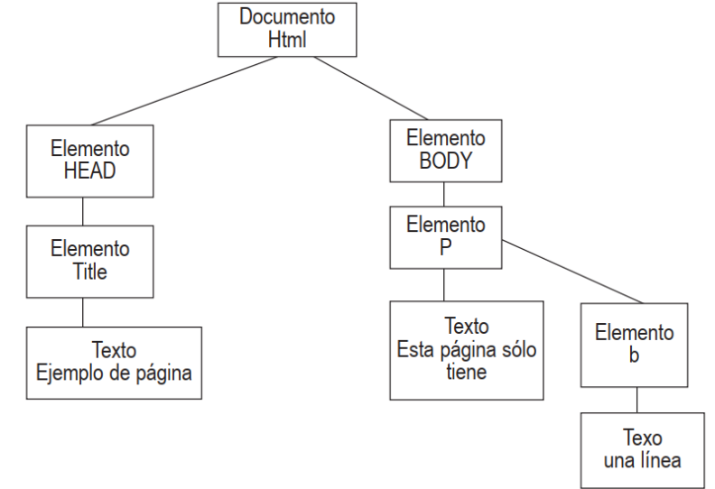

## DOM *Modelo de Objetos del Documento*

El término `DOM` corresponde a las siglas en inglés de *Document Object Model*, que en español significa **Modelo de Objetos del Documento**. Este concepto hace referencia a una representación estructurada de un documento `HTML`, la cual permite acceder y manipular sus elementos, atributos y contenido de manera programática.

El `DOM` actúa como una interfaz que traduce el código `HTML` en una estructura de nodos jerárquicos, facilitando la interacción y modificación del documento a través de lenguajes de programación como `JavaScript`. Gracias a esto, es posible alterar el contenido, el estilo o el comportamiento de una página web en tiempo real, respondiendo a eventos o acciones realizadas por el usuario.

En resumen, el `DOM` es una herramienta fundamental en la programación web, ya que permite actualizar y controlar dinámicamente los elementos de una página, haciendo posible que las aplicaciones web sean interactivas y adaptativas.

## ¿Qué es DOM?

Cada vez que se carga una página el navegador genera de forma automática una estructura que contiene todos y cada uno de los lementos de esa página. A través de mandatos de `JavaScript`, podemos manipular de forma dinámica estos elementos. El encargado de esto es el llamado `DOM`. Se trata de una de las características con mayor influencia en el diseño dinámico de páginas web ya que permite manejar de forma sensilla las páginas. `DOM` transforma una página en una estructura. Dicha estructura tiene forma de arbol y esta compuesta por `nodos`, de hecho a los nodos que dependen de otros se les suella llamar `nodos hijos` y al superior, `nodo padre`.

**Supongamos una página muy sencilla como la siguiente:**

```HTML
<html>
    <head>
        <title>Ejemplo de página.</title>
    </head>
    <body>
        <p>Esta página sólo tiene <b>una línea</b>.</p>
    </body>
</html>
```

**Se transformará en el siguiente árbol:**



Este es un ejemplo muy sencillo. Como podemos imaginar, lo habitual en una página cualquiera por la que naveguemos es que tenga muchísimos `nodos`, cientos de ellos.

## Tipos de nodos.

Si bien existen hasta 12 tipos de nodos, para manipular mediante `DOM` nuestras páginas nos basta con los que detallamos a continuación:

- **Documento**: es el principal, de él partirán todos los demás `nodos` que componen nuestra página. También le podemos llamar `nodo raíz`.
- **Elemento**: existirá uno por cada una de las etiquetas de `HTML`. De él pueden derivarse otros `nodos`.
- **Atributo**: representa los atributos de `HTML`.
- **Texto**: Representa el texto de la página.

